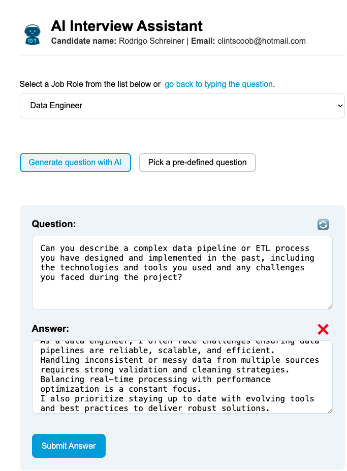
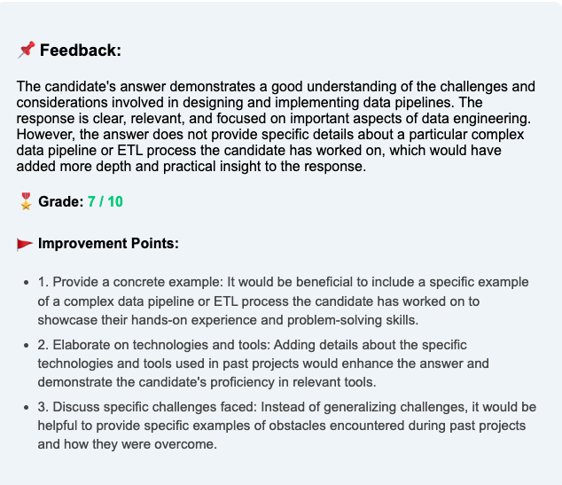

#  AI Interview Assistant

AI Interview Assistant is a full-stack web application that simulates real-world interview scenarios by allowing users to practice answering questions and receive instant, AI-generated feedback. It’s powered by OpenAI and LangChain and built with a modern React + Node.js stack.

This project demonstrates practical use of large language models (LLMs) in a user-focused application, including custom prompt design, paste detection, and feedback grading logic.

---

## 🛠 Built With

---

## 🌟 Key Features

- 🧑‍💼 Collects candidate name and email
- 💼 Choose a job role (typed or from dropdown)
- 🤖 Get AI-generated or predefined interview questions
- ✍️ Answer questions in a textarea (paste detection included)
- 📊 Uses OpenAI + LangChain to:
  - Grade answers (0–10)
  - Give bullet-point feedback
  - Detect copy-paste / AI-generated content
- 🧠 Feedback uses prompt templates with ChatPromptTemplate
- 🚫 Paste alert popup (optional)
- 🧽 Clean, modular React components
- 🔒 Fully local and secure (no data stored)

---

## ⚙️ Tech Stack

| Layer         | Technology              |
| ------------- | ----------------------- |
| Frontend      | React, CSS Modules      |
| Backend       | Node.js, Express        |
| AI Engine     | OpenAI API (`gpt-4`)    |
| Orchestration | LangChain               |
| HTTP Client   | Axios                   |
| Deployment    | Localhost / ngrok-ready |

---

## 🧠 How It Works

1. User enters their name and email (stored in local state)
2. Selects or types a job role
3. Picks AI or predefined question mode
4. Types their answer
5. Submits the response

The backend (Node.js + LangChain) takes the answer and question, runs it through a structured `ChatPromptTemplate`, and sends it to OpenAI's GPT model. The model returns:

- Feedback (in prose)
- Grade (0–10)
- Improvement points (2–5 depending on score)
- Optional note if it detects pasted/AI content

---

## 🧪 Example Question Answer Input

---

## 🧪 Example Feedback Output

